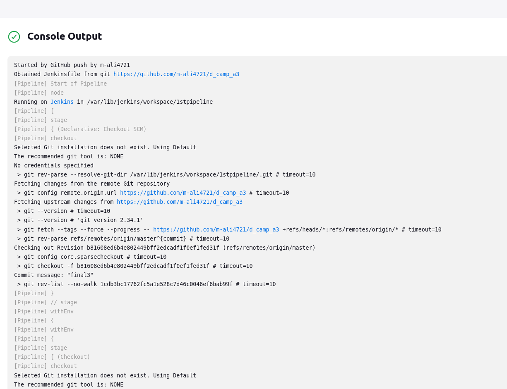
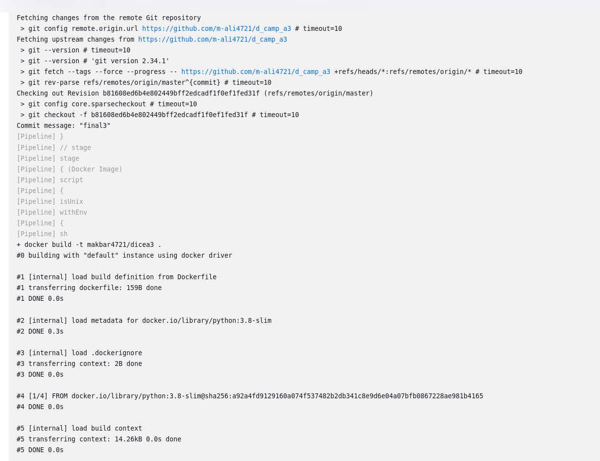
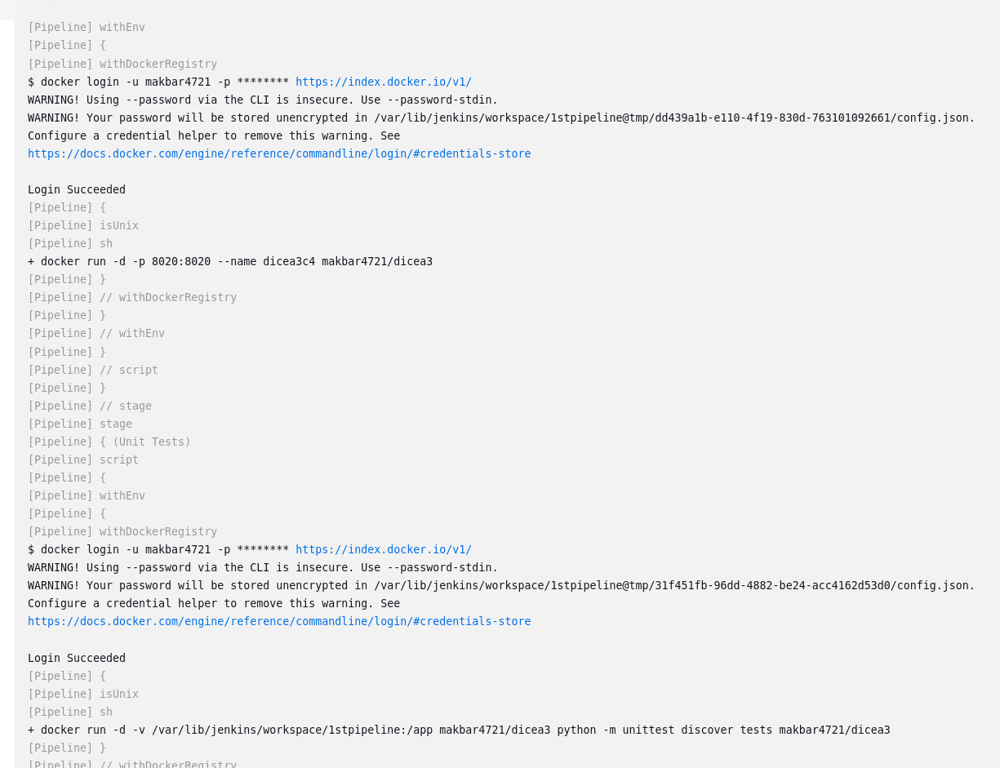
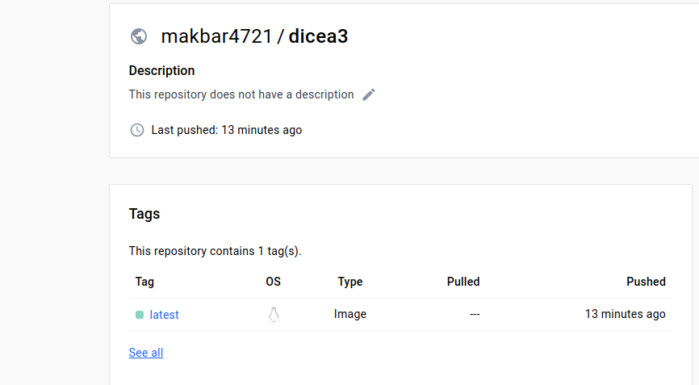
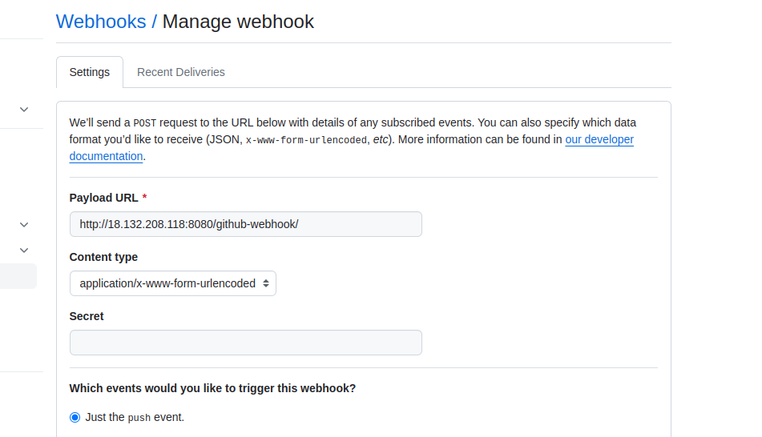

Jenkins has been used as the CI/CD Tool:

**Docker Image was created to build app.py application by using the stage of Build with corresponding script and following Output was produced depicting that it was successfully built and exported to Dockerhub:**
==================================================================================
docker build -t makbar4721/dicea3 .
#0 building with "default" instance using docker driver

#1 [internal] load build definition from Dockerfile
#1 transferring dockerfile: 159B done
#1 DONE 0.0s

#2 [internal] load metadata for docker.io/library/python:3.8-slim
#2 DONE 0.3s

#3 [internal] load .dockerignore
#3 transferring context: 2B done
#3 DONE 0.0s

#4 [1/4] FROM docker.io/library/python:3.8-slim@sha256:a92a4fd9129160a074f537482b2db341c8e9d6e04a07bfb0867228ae981b4165
#4 DONE 0.0s

#5 [internal] load build context
#5 transferring context: 14.26kB 0.0s done
#5 DONE 0.0s

#6 [2/4] WORKDIR /app
#6 CACHED

#7 [3/4] COPY . /app
#7 DONE 0.1s

#8 [4/4] RUN pip install -r requirements.txt
#8 2.160 Collecting flask
#8 2.215   Downloading flask-3.0.1-py3-none-any.whl (101 kB)
#8 2.243      ━━━━━━━━━━━━━━━━━━━━━━━━━━━━━━━━━━━━━━━ 101.2/101.2 kB 3.6 MB/s eta 0:00:00
#8 2.300 Collecting Jinja2>=3.1.2
#8 2.305   Downloading Jinja2-3.1.3-py3-none-any.whl (133 kB)
#8 2.319      ━━━━━━━━━━━━━━━━━━━━━━━━━━━━━━━━━━━━━━ 133.2/133.2 kB 12.1 MB/s eta 0:00:00
#8 2.386 Collecting Werkzeug>=3.0.0
#8 2.391   Downloading werkzeug-3.0.1-py3-none-any.whl (226 kB)
#8 2.405      ━━━━━━━━━━━━━━━━━━━━━━━━━━━━━━━━━━━━━━ 226.7/226.7 kB 22.8 MB/s eta 0:00:00
#8 2.435 Collecting itsdangerous>=2.1.2
#8 2.440   Downloading itsdangerous-2.1.2-py3-none-any.whl (15 kB)
#8 2.498 Collecting click>=8.1.3
#8 2.503   Downloading click-8.1.7-py3-none-any.whl (97 kB)
#8 2.514      ━━━━━━━━━━━━━━━━━━━━━━━━━━━━━━━━━━━━━━━━ 97.9/97.9 kB 12.6 MB/s eta 0:00:00
#8 2.541 Collecting blinker>=1.6.2
#8 2.546   Downloading blinker-1.7.0-py3-none-any.whl (13 kB)
#8 2.664 Collecting importlib-metadata>=3.6.0
#8 2.669   Downloading importlib_metadata-7.0.1-py3-none-any.whl (23 kB)
#8 2.763 Collecting zipp>=0.5
#8 2.768   Downloading zipp-3.17.0-py3-none-any.whl (7.4 kB)
#8 2.917 Collecting MarkupSafe>=2.0
#8 2.922   Downloading MarkupSafe-2.1.4-cp38-cp38-manylinux_2_17_x86_64.manylinux2014_x86_64.whl (26 kB)
#8 3.074 Installing collected packages: zipp, MarkupSafe, itsdangerous, click, blinker, Werkzeug, Jinja2, importlib-metadata, flask
#8 3.637 Successfully installed Jinja2-3.1.3 MarkupSafe-2.1.4 Werkzeug-3.0.1 blinker-1.7.0 click-8.1.7 flask-3.0.1 importlib-metadata-7.0.1 itsdangerous-2.1.2 zipp-3.17.0
#8 3.638 WARNING: Running pip as the 'root' user can result in broken permissions and conflicting behaviour with the system package manager. It is recommended to use a virtual environment instead: https://pip.pypa.io/warnings/venv
#8 3.799 
#8 3.799 [notice] A new release of pip is available: 23.0.1 -> 23.3.2
#8 3.799 [notice] To update, run: pip install --upgrade pip
#8 DONE 4.0s

#9 exporting to image
#9 exporting layers
#9 exporting layers 0.2s done
#9 writing image sha256:5a49597eea31ff6b045f64cf8bfa1399a10b304bf6b502055738347b14a61261 done
#9 naming to docker.io/makbar4721/dicea3 done
#9 DONE 0.2s
[Pipeline] }
[Pipeline] // withEnv
[Pipeline] }
[Pipeline] // script
[Pipeline] }
[Pipeline] // stage
[Pipeline] stage
[Pipeline] { (Uploading Image)
[Pipeline] script
[Pipeline] {
[Pipeline] withEnv
[Pipeline] {
[Pipeline] withDockerRegistry
$ docker login -u makbar4721 -p ******** https://index.docker.io/v1/
WARNING! Using --password via the CLI is insecure. Use --password-stdin.
WARNING! Your password will be stored unencrypted in /var/lib/jenkins/workspace/1stpipeline@tmp/8f5ae62f-7dae-4bc4-9ac5-4667c9e73a78/config.json.
Configure a credential helper to remove this warning. See
https://docs.docker.com/engine/reference/commandline/login/#credentials-store

Login Succeeded
[Pipeline] {
[Pipeline] isUnix
[Pipeline] withEnv
[Pipeline] {
[Pipeline] sh
+ docker tag makbar4721/dicea3 makbar4721/dicea3:latest
[Pipeline] }
[Pipeline] // withEnv
[Pipeline] isUnix
[Pipeline] withEnv
[Pipeline] {
[Pipeline] sh
+ docker push makbar4721/dicea3:latest
The push refers to repository [docker.io/makbar4721/dicea3]
3d1791b14192: Preparing
dbf081da55eb: Preparing
7e09a3174973: Preparing
8ffe8fa4c406: Preparing
681a1fc3389e: Preparing
47cdb7a27fca: Preparing
e96fe707bd25: Preparing
571ade696b26: Preparing
e96fe707bd25: Waiting
571ade696b26: Waiting
47cdb7a27fca: Waiting
681a1fc3389e: Layer already exists
8ffe8fa4c406: Layer already exists
7e09a3174973: Layer already exists
e96fe707bd25: Layer already exists
571ade696b26: Layer already exists
47cdb7a27fca: Layer already exists
dbf081da55eb: Pushed
3d1791b14192: Pushed

===================================================================================

**Moving forward, next stage for Docker Run was used through utilizing the previously built image and port was bound to 8020:**

[Pipeline] { (docker run)
[Pipeline] script
[Pipeline] {
[Pipeline] withEnv
[Pipeline] {
[Pipeline] withDockerRegistry
$ docker login -u makbar4721 -p ******** https://index.docker.io/v1/
WARNING! Using --password via the CLI is insecure. Use --password-stdin.
WARNING! Your password will be stored unencrypted in /var/lib/jenkins/workspace/1stpipeline@tmp/dd439a1b-e110-4f19-830d-763101092661/config.json.
Configure a credential helper to remove this warning. See
https://docs.docker.com/engine/reference/commandline/login/#credentials-store

Login Succeeded
[Pipeline] {
[Pipeline] isUnix
[Pipeline] sh
+ docker run -d -p 8020:8020 --name dicea3c4 makbar4721/dicea3
[Pipeline] }
[Pipeline] // withDockerRegistry
[Pipeline] }
[Pipeline] // withEnv
[Pipeline] }
[Pipeline] // script
[Pipeline] }
[Pipeline] // stage
[Pipeline] stage

===================================================================================

**Furthermore, a basic unit test was used to check if response was successfully being obtained as GET.**

[Pipeline] { (Unit Tests)
[Pipeline] script
[Pipeline] {
[Pipeline] withEnv
[Pipeline] {
[Pipeline] withDockerRegistry
$ docker login -u makbar4721 -p ******** https://index.docker.io/v1/
WARNING! Using --password via the CLI is insecure. Use --password-stdin.
WARNING! Your password will be stored unencrypted in /var/lib/jenkins/workspace/1stpipeline@tmp/31f451fb-96dd-4882-be24-acc4162d53d0/config.json.
Configure a credential helper to remove this warning. See
https://docs.docker.com/engine/reference/commandline/login/#credentials-store

Login Succeeded
[Pipeline] {
[Pipeline] isUnix
[Pipeline] sh
+ docker run -d -v /var/lib/jenkins/workspace/1stpipeline:/app makbar4721/dicea3 python -m unittest discover tests makbar4721/dicea3
[Pipeline] }
[Pipeline] // withDockerRegistry
[Pipeline] }
[Pipeline] // withEnv
[Pipeline] }
[Pipeline] // script
[Pipeline] }
[Pipeline] // stage
[Pipeline] }
[Pipeline] // withEnv
[Pipeline] }
[Pipeline] // withEnv
[Pipeline] }
[Pipeline] // node
[Pipeline] End of Pipeline
Finished: SUCCESS

===================================================================================

Pipeline Output:

Dockerhub:

Webhook:

